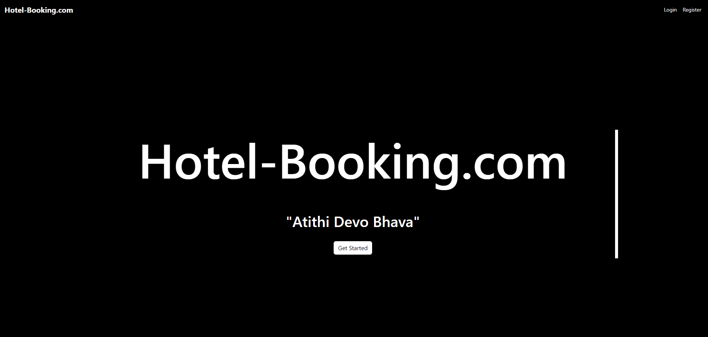
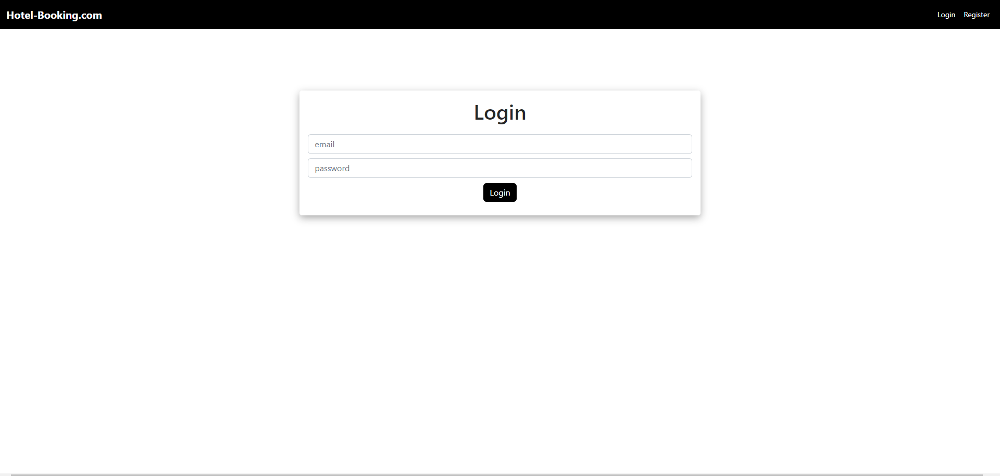
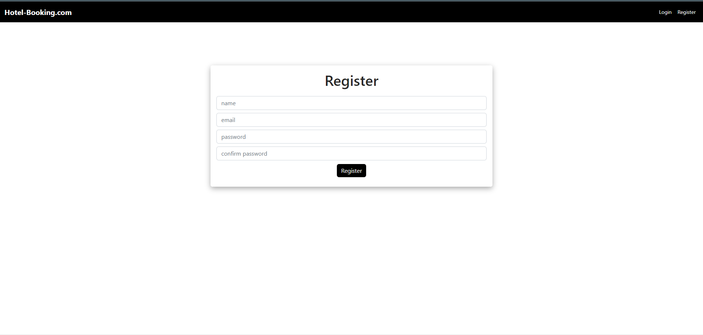
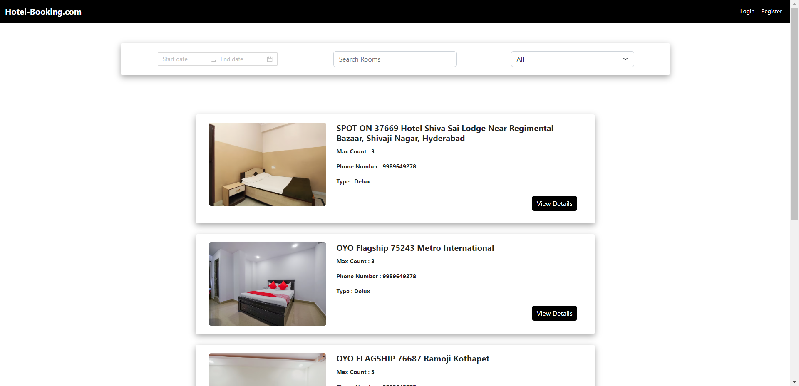
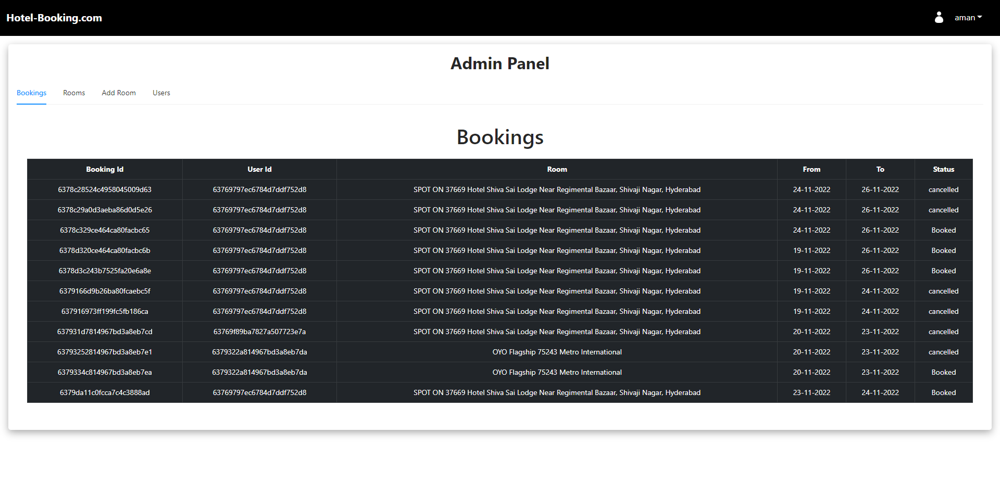

# Client-HBA(Hotel-Booking-App)

- This is the frontend part of the Hotel Booking Application.
- The app should be responsive in portrait mode and placed horizontally when in landscape mode.
- Implemented CRUD(Create, Read, Update, and Delete) operations on various collections such as bookings, users, etc of the database.
- Rendered rooms ‘filtered’ on the basis of their availability during selected dates, keywords, etc.
- Implemented user authentication and ACID properties in the booking of rooms, transactions, etc.
- Different levels of access for normal users and user-granted admin privileges.
- Techs Involved - NodeJS | ExpressJS | ReactJS | MongoDB | Postman | Git

### Detailed Design:

- Built the app using react functional components with hooks to handle state and other life cycle methods
- App component acts as the core parent component of the application, it takes care of loading the initial state, and data communication and also handles how the data gets propagated to various underlying components
- Initial state of the application is set by looking up the browser storage for any pre-selected city for which the report can be fetched
- Kept the layout of the application simple to have any modification or enhancement in the future to evolve the layout as required

## Image UI
Following are the screenshot of the application:

### Landing Page

- This is the landing page i.e. first page.

### Login Page

- This is the login page.

### Register Page

- This is the register page.

### Home Page

- This is the home page.

### Admin Panel Page

- This is the Admin Panel page which is only for admins only.

## How to Run the Application:

Clone the repo and set up the application

- git clone [https://github.com/amankumar-2001/hotel-booking-app](https://github.com/amankumar-2001/client-HBA.git)
- cd client-HBA
- npm install
- npm start

## Application Link:

Link to the Application hosted on Vercel ([LINK](https://client-hba.vercel.app/))

## Author

- [@amankumar-2001](https://www.github.com/amankumar-2001)
